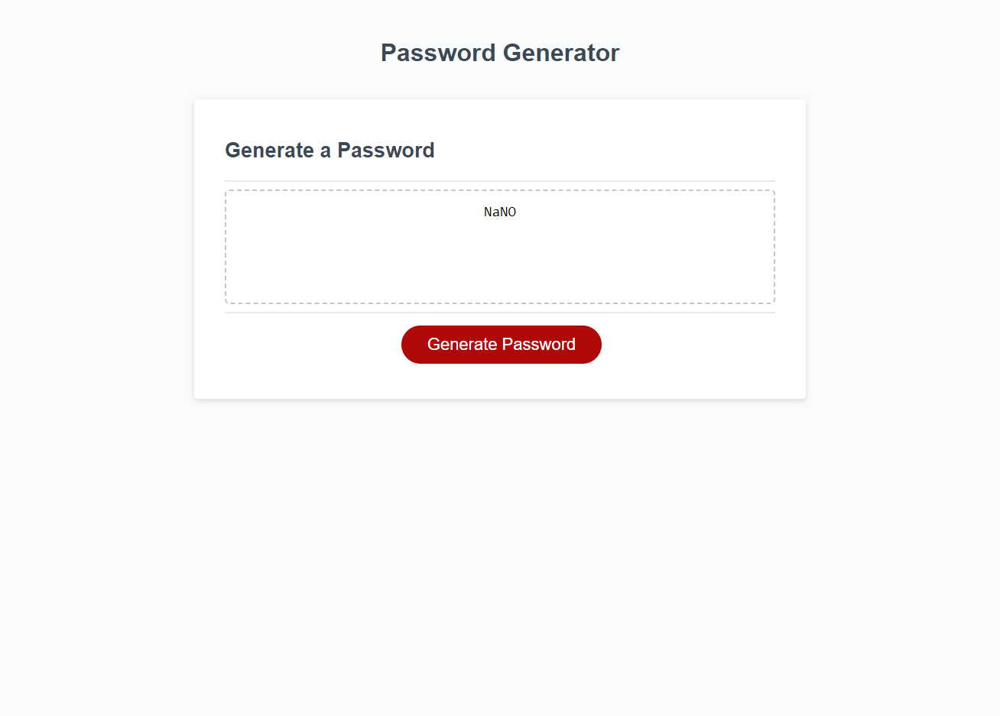
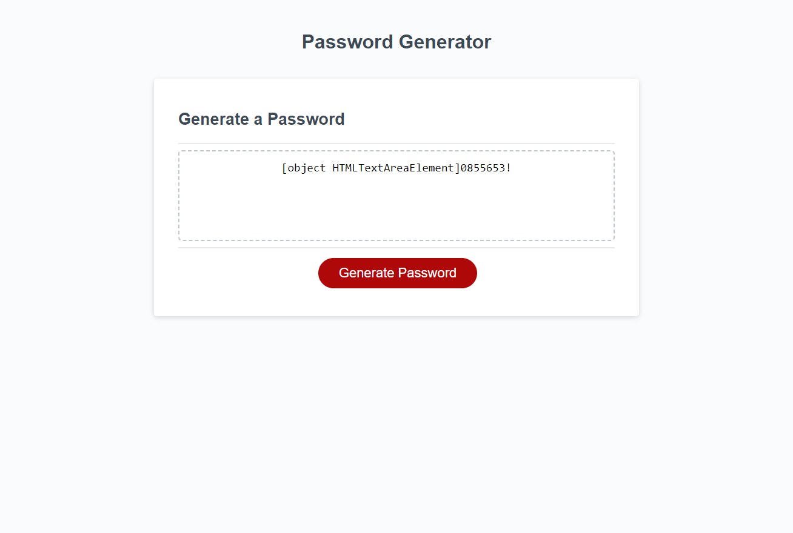

# Challenge-3
<br>

## Objective 
Refactor the starter code so that the website includes:
* A working password genrator that asks for user input
* Prompts user to select password criteria
* Generates random password given user selected criteria
<br>

## Technologies Used
* Javascript
* HTML
* CSS
<br>

## Knowledge Leared
* Learned how to use while loops 
```
 while (otherCriteria != "Y" && otherCriteria != "N") {
    otherCriteria = prompt("Do you wish to include lowercase, uppercase, numeric, and/or special characters? (Y for Yes and N for No)");
  }
```
* Leared how to generate random numbers 
```
for (var i = 0; i < length - 1; i++) {
      randomNumber = Math.floor(Math.random() * chars.length);
      passwordText += randomNumber;
    }
```
* Learned how to select characters from a string randomly using substring and random numbers
```
randomNumber1 = Math.floor(Math.random() * letters.length);
    passwordText += letters.substring(randomNumber1, randomNumber1 + 1);
```
<br>

## Bugs
* Password generator will not generate on the first try 

* On second attempt, password is generated but is accomnpanied with "Object HTMLTextAreaElement" 

<br>

## Link
https://ronzhao96.github.io/Challenge-3/